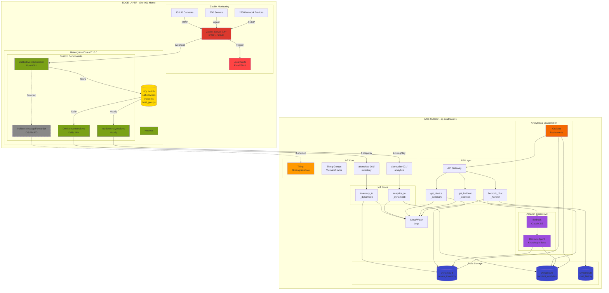
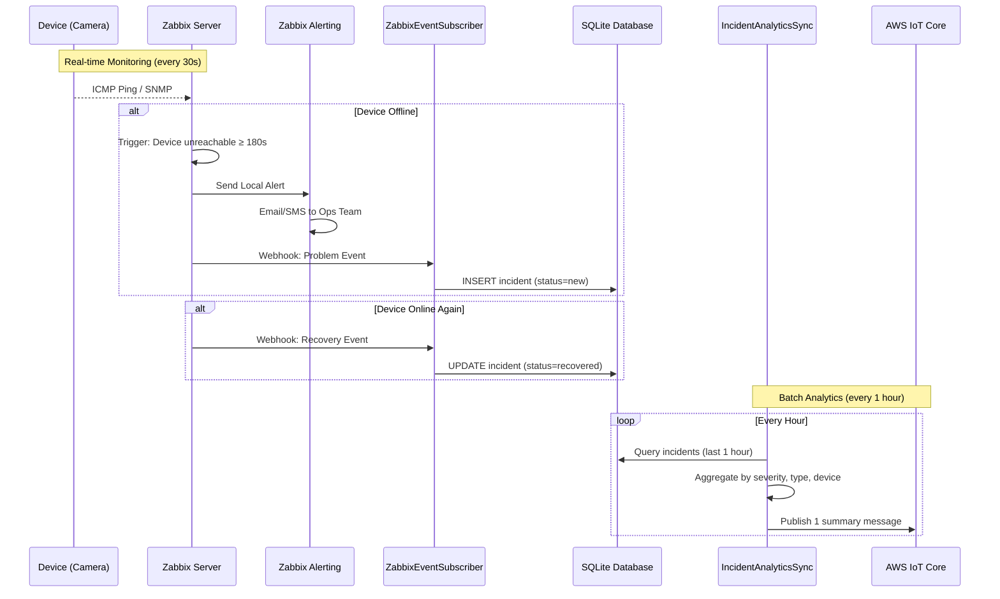
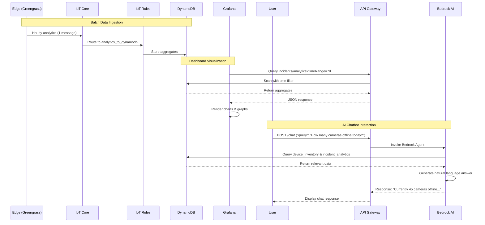
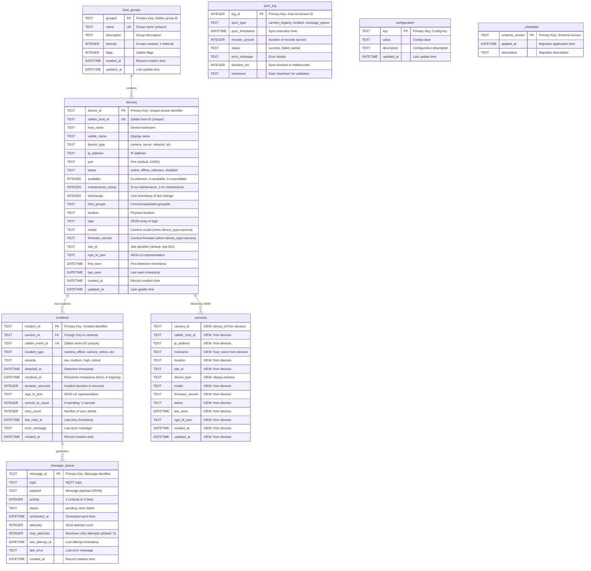
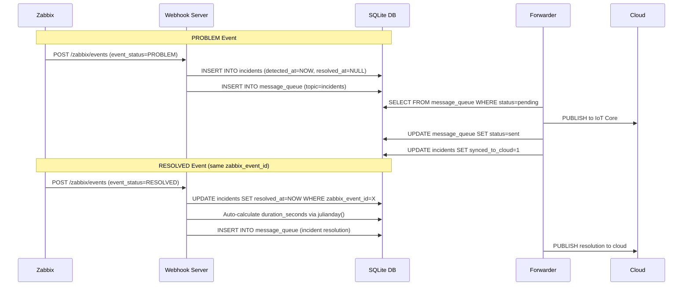
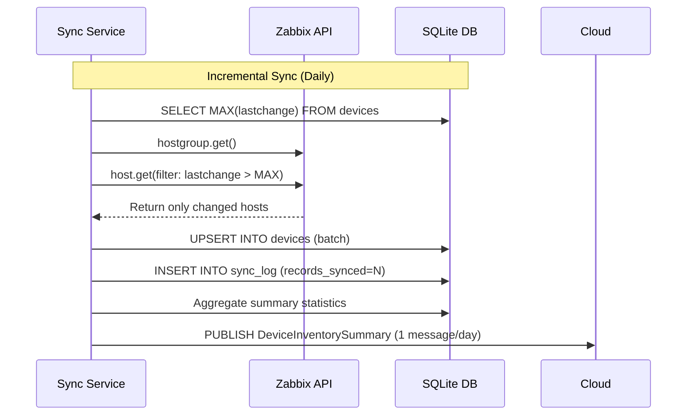
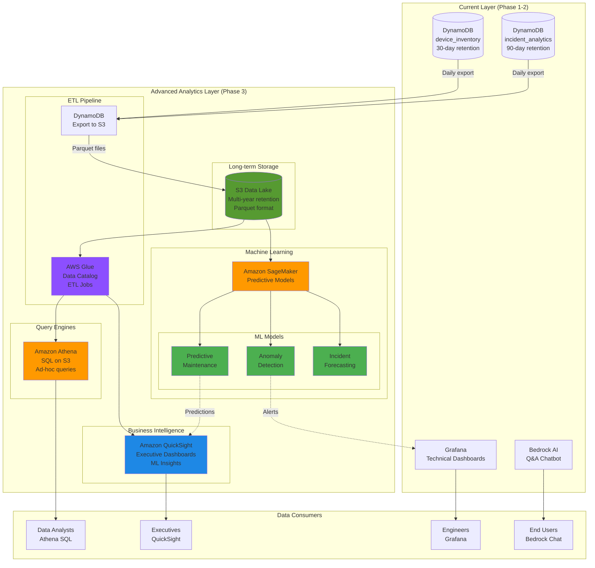
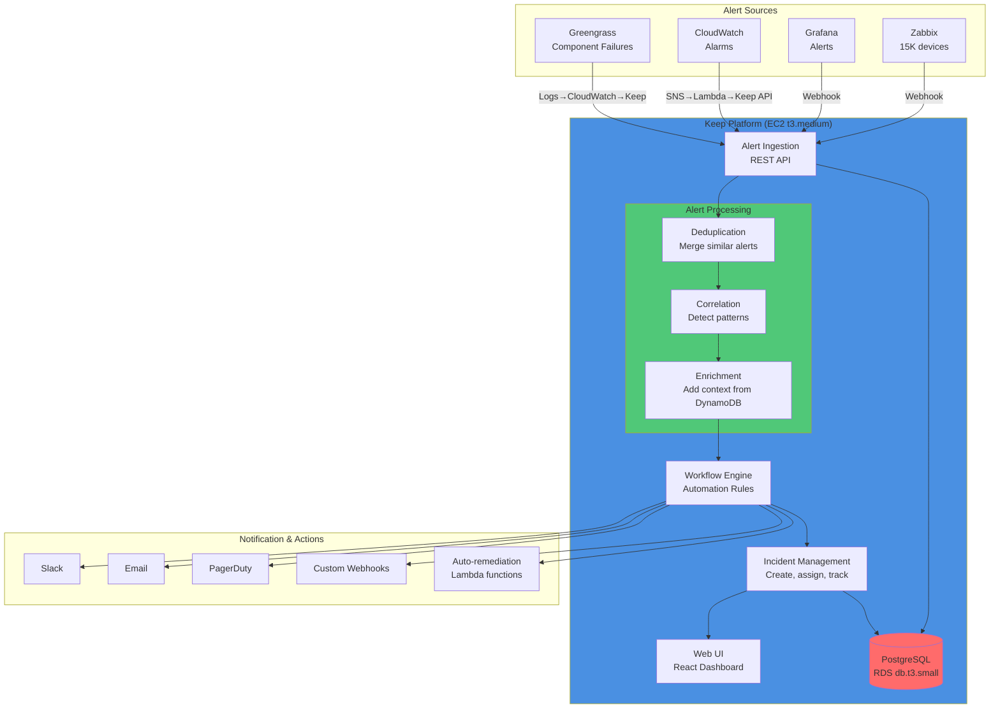

# AWS IoT Infrastructure Deployment Report v2.0

**Deployment Version**: v2.0 (Edge-First Analytics Architecture)
**Deployment Date**: 2026-01-01
**AWS Region**: ap-southeast-1 (Singapore)
**AWS Account**: 061100493617
**Environment**: dev
**Project**: AIOps-IoC (AI Smart Monitoring Camera)

---

## Executive Summary

### What Changed from v1.0

**v1.0 Architecture** (Real-time per-incident):
- Every incident → Immediate MQTT message to cloud
- Device Shadow updates for each device
- Real-time forwarding optimized for low-latency response

**v2.0 Architecture** (Edge-First Analytics):
- **Edge handles all real-time operations** (Zabbix monitoring & alerting)
- **Cloud receives batch analytics** (hourly incident summaries, daily device inventory)
- **95% reduction in cloud messages** (13,500 → 750 messages/month)
- **Cost-optimized** for large-scale deployments (15,000+ devices/site)
- **Analytics-focused cloud** (Grafana dashboards + Bedrock AI chatbot)

### Key Architectural Decisions

| Aspect | v1.0 (Real-time) | v2.0 (Edge-First Analytics) | Rationale |
|--------|------------------|----------------------------|-----------|
| **Incident Forwarding** | Every incident → Cloud | Hourly batch summaries | Cloud only needs analytics, not real-time ops |
| **Device Metadata** | Real-time updates | Daily batch summaries | Inventory changes infrequently |
| **Device Shadow** | Used for all devices | **NOT USED** ✅ | Cloud doesn't manage device state |
| **Alerting** | Cloud SNS alerts | **Zabbix local alerts** | Eliminate duplicate alerting |
| **Messages/month** | ~13,500 | ~750 (95% reduction) | Massive cost savings at scale |
| **Cloud Purpose** | Operations + Analytics | **Analytics only** | Clear separation of concerns |

---

## Architecture Overview

### High-Level Data Flow

```
┌─────────────────────────────────────────────────────────────┐
│ EDGE LAYER (Autonomous Operations)                         │
│  • 15,000 devices monitored by Zabbix (real-time)         │
│  • Local alerts & incident management                       │
│  • Periodic batch sync to cloud (analytics only)           │
└─────────────────────────────────────────────────────────────┘
                            ↓
              Batch Analytics (hourly/daily)
                            ↓
┌─────────────────────────────────────────────────────────────┐
│ CLOUD LAYER (Analytics & Insights)                         │
│  • Grafana dashboards (trends, statistics)                 │
│  • Bedrock AI chatbot (query incidents, devices)           │
│  • Historical data storage (DynamoDB)                       │
└─────────────────────────────────────────────────────────────┘
```

---

## Architecture Diagram

### Full System Architecture (v2.0)



### Edge Layer Detail (Device Monitoring Flow)



### Cloud Layer Detail (Analytics & AI Flow)



---

## Device Shadow Service - Detailed Evaluation

### What is AWS IoT Device Shadow?

**AWS IoT Device Shadow** is a JSON document that stores and retrieves **current state information** for a device.

#### Key Concepts:

1. **Shadow Structure**:
```json
{
  "state": {
    "desired": {
      "color": "red",
      "temperature": 20
    },
    "reported": {
      "color": "blue",
      "temperature": 25
    }
  },
  "metadata": {
    "desired": { "color": { "timestamp": 1234567890 }},
    "reported": { "color": { "timestamp": 1234567891 }}
  },
  "version": 123
}
```

2. **Two-way Sync**:
   - **Desired state**: What the cloud/application wants the device to be
   - **Reported state**: What the device actually is
   - Device and cloud sync via Shadow updates

3. **Use Cases**:
   - **Device Control**: Cloud sets `desired.brightness=100%`, device reads and adjusts
   - **Device State Query**: Query current device status even when device is offline
   - **Offline Synchronization**: Device comes online, receives missed desired state changes

### When Device Shadow is USEFUL

#### Scenario 1: IoT Device Control (Actuators)
```
Cloud Dashboard → Update Shadow (desired.temperature=22°C)
                → Device reads Shadow → Adjust thermostat
```

**Example**: Smart home devices, industrial control systems

#### Scenario 2: Device Configuration Management
```
Cloud → Set Shadow (desired.firmwareVersion="2.0.1")
     → Device downloads & updates firmware
     → Device reports Shadow (reported.firmwareVersion="2.0.1")
```

**Example**: Fleet firmware management for 10,000 devices

#### Scenario 3: Query Device State (Offline Support)
```
User asks: "Is camera-001 online?"
Cloud queries Shadow (reported.status) → "offline"
(Works even if camera is currently unreachable)
```

**Example**: Mobile app showing real-time device status

### When Device Shadow is NOT NEEDED (Our Case)

#### Our Requirements Analysis:

| Requirement | Need Shadow? | Why/Why Not |
|-------------|--------------|-------------|
| **Cloud controls devices** | ❌ NO | Devices monitored only, not controlled |
| **Query current device status** | ❌ NO | Zabbix provides real-time status, cloud only needs historical analytics |
| **Synchronize desired vs reported state** | ❌ NO | No "desired state" concept for passive monitoring |
| **Offline device state cache** | ❌ NO | Cloud doesn't need real-time device state, only trends |
| **Device configuration management** | ❌ NO | Devices configured via Zabbix, not AWS |

#### Our Architecture (Shadow NOT Used):

```
┌──────────────────────────────────────────────────┐
│ EDGE (Greengrass + Zabbix)                      │
│  • Zabbix monitors 15,000 devices (real-time)   │
│  • Device state stored in SQLite                 │
│  • Provides real-time status queries locally     │
│  • Cloud doesn't need individual device state    │
└──────────────────────────────────────────────────┘
                    ↓
      Periodic Batch Summaries (NOT Shadow updates)
                    ↓
┌──────────────────────────────────────────────────┐
│ CLOUD (Analytics Only)                           │
│  • DynamoDB: Aggregated device counts            │
│  • DynamoDB: Incident statistics                 │
│  • Grafana: Trend visualization                  │
│  • Bedrock: Answer analytical queries            │
│  ✅ NO need for individual device Shadow docs    │
└──────────────────────────────────────────────────┘
```

### Cost Comparison: With vs Without Shadow

#### Scenario: 15,000 devices

**With Device Shadow** (v1.0 approach):
```
15,000 devices × 1 Shadow update/incident × 10 incidents/month/device
= 150,000 Shadow operations/month

Cost: 150,000 × $1.25/million = $0.19/month

(Small cost, but unnecessary complexity)
```

**Without Device Shadow** (v2.0 approach):
```
0 Shadow operations

Cost: $0/month

Savings: $0.19/month (minimal, but cleaner architecture)
```

#### Complexity Comparison:

| Aspect | With Shadow | Without Shadow |
|--------|-------------|----------------|
| **Setup** | Create 15,000 Shadow documents | None needed |
| **Maintenance** | Monitor Shadow sync errors | None needed |
| **Debugging** | Check Shadow delta, version conflicts | Simpler: Just query DynamoDB aggregates |
| **Code complexity** | Shadow update logic in every component | Direct MQTT publish only |

### Decision: Do NOT Use Device Shadow ✅

**Reasons:**
1. ✅ **Cloud doesn't control devices** - No desired state to sync
2. ✅ **Cloud doesn't need real-time device state** - Only analytics
3. ✅ **Zabbix provides real-time state** - Edge has authoritative state
4. ✅ **Simpler architecture** - Fewer moving parts
5. ✅ **Lower complexity** - No Shadow sync logic needed

**Exception - Greengrass Core Shadow ONLY:**
- We DO use Shadow for the **Greengrass Core device itself** (1 Shadow document)
- Purpose: Track Greengrass component versions, deployment status
- This is managed automatically by Greengrass service

---

## Edge Database Schema (SQLite)

**Schema Version**: 3.0.0 (Unified Devices Architecture)
**Migration Date**: 2026-01-02
**Key Change**: `cameras` TABLE → `cameras` VIEW (100% backward compatible)

### Entity Relationship Diagram (ERD)



---

### Database Tables - Detailed Field Descriptions

#### 1. **devices** Table (Universal Device Registry)

**Purpose**: Universal registry for all monitored devices (cameras, servers, network devices). This is the main device table that replaced the legacy `cameras` table.

**Schema Version**: 3.0.0 - Extended with camera-specific fields (model, firmware_version, site_id)

| Field Name | Data Type | Constraints | Description |
|------------|-----------|-------------|-------------|
| `device_id` | TEXT | PRIMARY KEY | Unique device identifier (e.g., "DEV-12345") |
| `zabbix_host_id` | TEXT | UNIQUE, NOT NULL | Zabbix host ID for API queries (indexed) |
| `host_name` | TEXT | NOT NULL | Device hostname from Zabbix |
| `visible_name` | TEXT | - | Display-friendly name |
| `device_type` | TEXT | DEFAULT 'unknown' | Device category: `camera`, `server`, `network`, `unknown` |
| `ip_address` | TEXT | UNIQUE (with port) | Device IP address |
| `port` | TEXT | DEFAULT '10050' | Zabbix agent port |
| `status` | TEXT | DEFAULT 'unknown' | Current status: `online`, `offline`, `unknown`, `disabled` |
| `available` | INTEGER | DEFAULT 0 | Zabbix availability: 0=unknown, 1=available, 2=unavailable |
| `maintenance_status` | INTEGER | DEFAULT 0 | Maintenance flag: 0=active, 1=maintenance mode |
| `lastchange` | INTEGER | - | Unix timestamp of last status change (for incremental sync) |
| `host_groups` | TEXT | - | Comma-separated Zabbix group IDs |
| `location` | TEXT | - | Physical location (building, floor, room) |
| `tags` | TEXT | - | JSON array of custom tags |
| `model` | TEXT | - | **Camera-specific**: Device model (e.g., "HikVision DS-2CD2043") |
| `firmware_version` | TEXT | - | **Camera-specific**: Firmware version (e.g., "v5.6.3") |
| `site_id` | TEXT | DEFAULT 'site-001' | **Camera-specific**: Site identifier for multi-site deployments |
| `ngsi_ld_json` | TEXT | NOT NULL | Complete NGSI-LD entity representation |
| `first_seen` | DATETIME | DEFAULT CURRENT_TIMESTAMP | First detection timestamp |
| `last_seen` | DATETIME | DEFAULT CURRENT_TIMESTAMP | Last heartbeat timestamp |
| `created_at` | DATETIME | DEFAULT CURRENT_TIMESTAMP | Record creation timestamp |
| `updated_at` | DATETIME | DEFAULT CURRENT_TIMESTAMP | Last update timestamp (auto-updated via trigger) |

**Indexes**:
- `idx_devices_zabbix_host` on `zabbix_host_id`
- `idx_devices_type` on `device_type`
- `idx_devices_status` on `status`
- `idx_devices_ip` on `ip_address`
- `idx_devices_updated` on `updated_at`
- `idx_devices_lastchange` on `lastchange`

**Triggers**:
- `update_devices_timestamp`: Auto-updates `updated_at` on row modification

---

#### 2. **cameras** VIEW (Backward Compatibility) ⭐

**Purpose**: SQL VIEW that filters `devices` table for cameras (WHERE device_type='camera'). Provides 100% backward compatibility - all existing code works unchanged.

**Migration**: v3.0 - cameras TABLE replaced with VIEW (2026-01-02)

**Important**: This is a **VIEW**, not a table. All INSERT/UPDATE/SELECT operations on `cameras` automatically operate on the underlying `devices` table.

| Field Name | Data Type | Constraints | Description |
|------------|-----------|-------------|-------------|
| `camera_id` | TEXT | VIEW field | Maps to `device_id` from devices table |
| `zabbix_host_id` | TEXT | VIEW field | From `devices.zabbix_host_id` |
| `ip_address` | TEXT | VIEW field | From `devices.ip_address` |
| `hostname` | TEXT | VIEW field | From `devices.host_name` |
| `location` | TEXT | VIEW field | From `devices.location` |
| `site_id` | TEXT | VIEW field | From `devices.site_id` |
| `device_type` | TEXT | VIEW field | Always 'camera' (filter condition) |
| `model` | TEXT | VIEW field | From `devices.model` |
| `firmware_version` | TEXT | VIEW field | From `devices.firmware_version` |
| `status` | TEXT | VIEW field | From `devices.status` |
| `last_seen` | DATETIME | VIEW field | From `devices.last_seen` |
| `ngsi_ld_json` | TEXT | VIEW field | From `devices.ngsi_ld_json` |
| `created_at` | DATETIME | VIEW field | From `devices.created_at` |
| `updated_at` | DATETIME | VIEW field | From `devices.updated_at` |

**VIEW Definition**:
```sql
CREATE VIEW cameras AS
SELECT
    device_id as camera_id,
    zabbix_host_id,
    ip_address,
    host_name as hostname,
    location,
    site_id,
    device_type,
    model,
    firmware_version,
    status,
    last_seen,
    ngsi_ld_json,
    created_at,
    updated_at
FROM devices
WHERE device_type = 'camera';
```

**Backward Compatibility**:
- ✅ All SELECT queries work unchanged
- ✅ All WHERE clauses work unchanged
- ✅ All JOINs work unchanged
- ✅ CameraDAO code works without modification
- ✅ Existing applications require ZERO code changes

**Note**: Indexes are on the underlying `devices` table, not the VIEW

---

#### 3. **incidents** Table

**Purpose**: Store incident records (device failures, alerts, problems). Tracks full incident lifecycle from detection to resolution.

| Field Name | Data Type | Constraints | Description |
|------------|-----------|-------------|-------------|
| `incident_id` | TEXT | PRIMARY KEY | Unique incident identifier (e.g., "INC-20260102152630-abc123") |
| `camera_id` | TEXT | FOREIGN KEY | Reference to `cameras.camera_id` |
| `zabbix_event_id` | TEXT | UNIQUE | Zabbix event ID for correlation (prevents duplicate incidents) |
| `incident_type` | TEXT | NOT NULL | Type: `camera_offline`, `camera_online`, `sensor_fault`, etc. |
| `severity` | TEXT | NOT NULL | Severity level: `low`, `medium`, `high`, `critical` |
| `detected_at` | DATETIME | NOT NULL | Incident detection timestamp (ISO 8601 format) |
| `resolved_at` | DATETIME | - | Resolution timestamp (NULL if ongoing) |
| `duration_seconds` | INTEGER | - | Incident duration (auto-calculated via SQLite julianday function) |
| `ngsi_ld_json` | TEXT | NOT NULL | NGSI-LD entity representation |
| `synced_to_cloud` | INTEGER | DEFAULT 0 | Cloud sync status: 0=pending, 1=synced |
| `retry_count` | INTEGER | DEFAULT 0 | Number of cloud sync retry attempts |
| `last_retry_at` | DATETIME | - | Last cloud sync retry timestamp |
| `error_message` | TEXT | - | Last cloud sync error message |
| `created_at` | DATETIME | DEFAULT CURRENT_TIMESTAMP | Record creation timestamp |

**Indexes**:
- `idx_incidents_camera` on `camera_id`
- `idx_incidents_type` on `incident_type`
- `idx_incidents_severity` on `severity`
- `idx_incidents_synced` on `synced_to_cloud`
- `idx_incidents_detected` on `detected_at`
- `idx_incidents_zabbix_event` on `zabbix_event_id`

**Key Behaviors**:
- **PROBLEM Events**: INSERT new incident with `detected_at`, `resolved_at=NULL`
- **RESOLVED Events**: UPDATE existing incident (matched by `zabbix_event_id`) with `resolved_at` and auto-calculate `duration_seconds`
- **Duration Calculation**: `(julianday(resolved_at) - julianday(detected_at)) * 86400` seconds

---

#### 4. **host_groups** Table

**Purpose**: Store Zabbix host groups for device categorization and filtering.

| Field Name | Data Type | Constraints | Description |
|------------|-----------|-------------|-------------|
| `groupid` | TEXT | PRIMARY KEY | Zabbix group ID |
| `name` | TEXT | UNIQUE, NOT NULL | Group name (e.g., "IP_Cameras_Building_A") |
| `description` | TEXT | - | Group description |
| `internal` | INTEGER | DEFAULT 0 | 0=user-created group, 1=Zabbix internal group |
| `flags` | INTEGER | DEFAULT 0 | Zabbix flags |
| `created_at` | DATETIME | DEFAULT CURRENT_TIMESTAMP | Record creation timestamp |
| `updated_at` | DATETIME | DEFAULT CURRENT_TIMESTAMP | Last update timestamp (auto-updated via trigger) |

**Indexes**:
- `idx_hostgroups_name` on `name`
- `idx_hostgroups_updated` on `updated_at`

**Triggers**:
- `update_hostgroups_timestamp`: Auto-updates `updated_at` on row modification

---

#### 5. **message_queue** Table

**Purpose**: Persistent message queue for cloud-bound MQTT messages. Provides offline resilience and retry logic.

| Field Name | Data Type | Constraints | Description |
|------------|-----------|-------------|-------------|
| `message_id` | TEXT | PRIMARY KEY | Unique message identifier (UUID) |
| `topic` | TEXT | NOT NULL | MQTT topic (e.g., "aismc/site-001/incidents") |
| `payload` | TEXT | NOT NULL | Message payload (JSON string) |
| `priority` | INTEGER | DEFAULT 3 | Message priority: 1=critical, 2=high, 3=normal, 4=low, 5=background |
| `status` | TEXT | DEFAULT 'pending' | Queue status: `pending`, `sent`, `failed` |
| `scheduled_at` | DATETIME | DEFAULT CURRENT_TIMESTAMP | Scheduled send timestamp |
| `attempts` | INTEGER | DEFAULT 0 | Number of send attempts |
| `max_attempts` | INTEGER | DEFAULT 3 | Maximum retry attempts before marking as failed |
| `last_attempt_at` | DATETIME | - | Last send attempt timestamp |
| `last_error` | TEXT | - | Last error message |
| `created_at` | DATETIME | DEFAULT CURRENT_TIMESTAMP | Record creation timestamp |

**Indexes**:
- `idx_queue_status` on `status`
- `idx_queue_priority` on `(priority, scheduled_at)` (composite for efficient ordering)
- `idx_queue_scheduled` on `scheduled_at`

**Queue Processing Logic**:
```sql
-- Get pending messages (ordered by priority, then time)
SELECT * FROM message_queue
WHERE status = 'pending' AND attempts < max_attempts
ORDER BY priority ASC, scheduled_at ASC
LIMIT 10;
```

---

#### 6. **sync_log** Table

**Purpose**: Audit trail for synchronization operations. Tracks performance and error history.

| Field Name | Data Type | Constraints | Description |
|------------|-----------|-------------|-------------|
| `log_id` | INTEGER | PRIMARY KEY AUTOINCREMENT | Auto-incrementing log ID |
| `sync_type` | TEXT | NOT NULL | Sync type: `camera_registry`, `incident`, `message_queue`, `device_inventory` |
| `sync_timestamp` | DATETIME | DEFAULT CURRENT_TIMESTAMP | Sync execution timestamp |
| `records_synced` | INTEGER | DEFAULT 0 | Number of records processed |
| `status` | TEXT | NOT NULL | Sync result: `success`, `failed`, `partial` |
| `error_message` | TEXT | - | Error details (if status=failed) |
| `duration_ms` | INTEGER | - | Sync duration in milliseconds |
| `checksum` | TEXT | - | Data checksum for validation |

**Indexes**:
- `idx_sync_log_type` on `sync_type`
- `idx_sync_log_timestamp` on `sync_timestamp`

**Usage**:
```python
# Log successful sync
sync_log_dao.log(
    sync_type='device_inventory',
    records_synced=150,
    status='success',
    duration_ms=245
)
```

---

#### 7. **configuration** Table

**Purpose**: Key-value configuration storage for runtime settings.

| Field Name | Data Type | Constraints | Description |
|------------|-----------|-------------|-------------|
| `key` | TEXT | PRIMARY KEY | Configuration key (e.g., "site_id", "sync_interval") |
| `value` | TEXT | NOT NULL | Configuration value |
| `description` | TEXT | - | Human-readable description |
| `updated_at` | DATETIME | DEFAULT CURRENT_TIMESTAMP | Last update timestamp (auto-updated via trigger) |

**Triggers**:
- `update_config_timestamp`: Auto-updates `updated_at` on row modification

**Example Configuration Keys**:
```sql
INSERT INTO configuration (key, value, description) VALUES
('site_id', 'site-001', 'Site identifier for this Greengrass Core'),
('zabbix_api_url', 'http://localhost:8080/api_jsonrpc.php', 'Zabbix API endpoint'),
('sync_interval', '86400', 'Device sync interval in seconds (24 hours)'),
('cloud_sync_enabled', 'true', 'Enable cloud message forwarding');
```

---

#### 8. **_metadata** Table

**Purpose**: Track database schema versions and migration history.

| Field Name | Data Type | Constraints | Description |
|------------|-----------|-------------|-------------|
| `schema_version` | TEXT | PRIMARY KEY | Schema version identifier (e.g., "v2.0", "2026-01-01-add-devices-table") |
| `applied_at` | DATETIME | DEFAULT CURRENT_TIMESTAMP | Migration application timestamp |
| `description` | TEXT | - | Migration description |

**Example Usage**:
```sql
-- Record schema migration
INSERT INTO _metadata (schema_version, description) VALUES
('v2.0', 'Added devices table for universal device support'),
('v2.1', 'Added host_groups table for Zabbix group registry');
```

---

### Database Views

The database includes several materialized views for common queries:

#### **v_active_cameras**
```sql
SELECT * FROM cameras WHERE status != 'offline' ORDER BY updated_at DESC
```
**Purpose**: Quick access to online cameras

#### **v_offline_cameras**
```sql
SELECT * FROM cameras WHERE status = 'offline' ORDER BY last_seen DESC
```
**Purpose**: Monitor offline cameras, sorted by last seen time

#### **v_pending_incidents**
```sql
SELECT * FROM incidents
WHERE synced_to_cloud = 0 AND retry_count < 3
ORDER BY
    CASE severity
        WHEN 'critical' THEN 1
        WHEN 'high' THEN 2
        WHEN 'medium' THEN 3
        ELSE 4
    END,
    detected_at ASC
```
**Purpose**: Get incidents pending cloud sync, ordered by severity and time

#### **v_failed_messages**
```sql
SELECT * FROM message_queue
WHERE status = 'failed'
ORDER BY priority ASC, created_at DESC
```
**Purpose**: Monitor failed message queue items

---

### Data Flow & Lifecycle

#### Incident Lifecycle (PROBLEM → RESOLVED)



#### Device Sync Lifecycle (Incremental)



---

### Database Performance & Maintenance

**Database Size Estimates** (15,000 devices, 500 incidents/day):

| Table | Rows | Size per Row | Total Size | Retention |
|-------|------|--------------|------------|-----------|
| devices | 15,000 | ~1 KB | 15 MB | Permanent |
| cameras | 15,000 | ~800 bytes | 12 MB | Legacy (can archive) |
| incidents | 180,000/year | ~600 bytes | 108 MB/year | 90 days (auto-purge) |
| message_queue | 500-1000 | ~400 bytes | 0.5 MB | 7 days (auto-purge) |
| host_groups | 50 | ~200 bytes | 10 KB | Permanent |
| sync_log | 365/year | ~150 bytes | 55 KB/year | 1 year |
| configuration | 20 | ~100 bytes | 2 KB | Permanent |
| **Total** | - | - | **~150 MB/year** | - |

**Maintenance Scripts**:

```bash
# Purge old resolved incidents (>90 days)
sqlite3 /var/greengrass/database/greengrass.db "
DELETE FROM incidents
WHERE resolved_at IS NOT NULL
AND resolved_at < datetime('now', '-90 days');
"

# Purge sent messages (>7 days)
sqlite3 /var/greengrass/database/greengrass.db "
DELETE FROM message_queue
WHERE status = 'sent'
AND created_at < datetime('now', '-7 days');
"

# Vacuum database (reclaim space)
sqlite3 /var/greengrass/database/greengrass.db "VACUUM;"

# Analyze for query optimization
sqlite3 /var/greengrass/database/greengrass.db "ANALYZE;"
```

**WAL Mode Configuration** (Write-Ahead Logging):
```sql
-- Enable WAL mode for better concurrent access
PRAGMA journal_mode=WAL;
PRAGMA synchronous=NORMAL;
PRAGMA cache_size=-64000;  -- 64MB cache
```

---

## Component Details

### Edge Components (AWS IoT Greengrass)

#### 1. com.aismc.ZabbixEventSubscriber v1.0.0 ✅ ACTIVE

**Purpose**: Receive Zabbix webhook events in real-time

**Configuration**:
```yaml
ComponentConfiguration:
  DefaultConfiguration:
    webhook_port: 8081
    zabbix_webhook_path: "/zabbix/events"
    health_check_port: 8081
    log_level: "INFO"
```

**Features**:
- HTTP server listening on port 8081
- Parse Zabbix problem/recovery webhooks
- Extract: device_id, severity, timestamp, incident_type
- Store in SQLite `incidents` table
- Health check endpoint: `http://localhost:8081/health`

**Data Flow**:
```
Zabbix → POST http://localhost:8081/zabbix/events
      → Parse JSON → Store SQLite → Done
```

**Status**: ✅ RUNNING

---

#### 2. com.aismc.IncidentMessageForwarder v1.0.0 ⏸️ DISABLED (Backup)

**Purpose**: Real-time incident forwarding to AWS IoT Core

**Configuration**:
```yaml
ComponentConfiguration:
  DefaultConfiguration:
    enabled: "false"  # ← DISABLED by default
    poll_interval: 10
    batch_size: 10
    max_retries: 5
    site_id: "site-001"
```

**Features**:
- Poll `message_queue` table every 10 seconds
- Transform to NGSI-LD format
- Publish to `aismc/{site_id}/incidents` topic
- Retry logic with exponential backoff

**Why Disabled**:
- Cloud only needs batch analytics, not real-time incidents
- Reduces cloud messaging costs by 95%
- Can enable via configuration if real-time forwarding needed

**How to Enable**:
```bash
# Update deployment configuration
sudo /greengrass/v2/bin/greengrass-cli deployment create \
  --merge "com.aismc.IncidentMessageForwarder=1.0.0" \
  --update-config '{"com.aismc.IncidentMessageForwarder": {"MERGE": {"enabled": "true"}}}'
```

**Status**: ⏸️ RUNNING but idle (enabled=false)

---

#### 3. com.aismc.DeviceInventorySync v1.0.0 ✅ ACTIVE

**Purpose**: Daily device inventory summary to cloud

**Configuration**:
```yaml
ComponentConfiguration:
  DefaultConfiguration:
    zabbix_api_url: "http://localhost:8080/api_jsonrpc.php"
    zabbix_username: "Admin"
    zabbix_password: "zabbix"
    sync_schedule: "0 2 * * *"  # Daily at 2AM
    sync_interval: 86400  # 24 hours in seconds
    site_id: "site-001"
    topic_prefix: "aismc"
```

**Features**:
1. **Fetch from Zabbix API**:
   - All hosts (cameras, servers, network devices)
   - All host groups
   - Incremental sync using `lastchange` timestamp

2. **Store in SQLite**:
   - `devices` table (full metadata)
   - `host_groups` table (group registry)

3. **Publish Summary to Cloud**:
   ```json
   {
     "type": "DeviceInventorySummary",
     "site_id": "site-001",
     "timestamp": "2026-01-01T02:00:00Z",
     "summary": {
       "total_devices": 15000,
       "by_host_group": {
         "IP_Cameras_Building_A": 5000,
         "Servers": 250
       },
       "by_device_type": {
         "camera": 12500,
         "server": 250,
         "network": 2250
       },
       "by_status": {
         "online": 14850,
         "offline": 120,
         "maintenance": 30
       }
     }
   }
   ```

**MQTT Topic**: `aismc/site-001/inventory`
**Frequency**: 1 message/day
**Status**: ✅ RUNNING (scheduled)

---

#### 4. com.aismc.IncidentAnalyticsSync v1.0.0 ✅ ACTIVE (NEW)

**Purpose**: Hourly incident analytics summary to cloud

**Configuration**:
```yaml
ComponentConfiguration:
  DefaultConfiguration:
    site_id: "site-001"
    sync_interval: 3600  # 1 hour
    topic_prefix: "aismc"
    top_affected_count: 10
    enabled: "true"
```

**Features**:
1. **Query SQLite** (incidents from last hour)
2. **Aggregate**:
   - Total, new, recovered, ongoing incidents
   - By severity (critical, high, medium, low)
   - By device type (camera, server, network)
   - By host group
   - Top N affected devices

3. **Publish Summary**:
   ```json
   {
     "type": "IncidentAnalyticsSummary",
     "site_id": "site-001",
     "timestamp": "2026-01-01T10:00:00Z",
     "period": {
       "start": "2026-01-01T09:00:00Z",
       "end": "2026-01-01T10:00:00Z",
       "duration_seconds": 3600
     },
     "incidents": {
       "total": 45,
       "new": 28,
       "recovered": 17,
       "ongoing": 11,
       "by_severity": {
         "critical": 3,
         "high": 12,
         "medium": 20,
         "low": 10
       },
       "by_device_type": {
         "camera": 38,
         "server": 4,
         "network": 3
       },
       "top_affected_devices": [
         {"device_id": "DEV-1234", "incidents": 5}
       ]
     }
   }
   ```

**MQTT Topic**: `aismc/site-001/analytics`
**Frequency**: 24 messages/day (hourly)
**Status**: ✅ RUNNING (scheduled)

---

### Cloud Components

#### IoT Rules Engine

**1. inventory_to_dynamodb**
```sql
SELECT
  site_id,
  timestamp,
  summary.total_devices as total_devices,
  summary.by_host_group as by_host_group,
  summary.by_device_type as by_device_type,
  summary.by_status as by_status
FROM 'aismc/+/inventory'
```

**Action**: DynamoDB PutItem → `device_inventory` table
**Error Handling**: CloudWatch Logs `/aws/iot/rules/aismc-dev/errors`

---

**2. analytics_to_dynamodb**
```sql
SELECT
  site_id,
  timestamp,
  period,
  incidents
FROM 'aismc/+/analytics'
```

**Action**: DynamoDB PutItem → `incident_analytics` table
**Error Handling**: CloudWatch Logs `/aws/iot/rules/aismc-dev/errors`

---

#### DynamoDB Tables

**1. device_inventory**

**Purpose**: Daily device inventory snapshots

**Schema**:
```
Primary Key:
  - HASH: site_id (String)
  - RANGE: timestamp (Number) - Unix timestamp

Attributes:
  - total_devices (Number)
  - by_host_group (Map)
  - by_device_type (Map)
  - by_status (Map)
  - date (String) - "2026-01-01" for easy filtering

GSI: date-index
  - HASH: date (String)
  - Purpose: Query all sites for a specific date
```

**Billing**: PAY_PER_REQUEST
**Estimated Cost**: ~1 write/day/site = 30 writes/month = $0.00004/month

---

**2. incident_analytics**

**Purpose**: Hourly incident analytics

**Schema**:
```
Primary Key:
  - HASH: site_id (String)
  - RANGE: timestamp (Number) - Unix timestamp

Attributes:
  - period (Map) - {start, end, duration_seconds}
  - incidents (Map) - {total, by_severity, by_type, top_devices}
  - hour (String) - "2026-01-01T10:00:00Z" for easy filtering

GSI: hour-index
  - HASH: hour (String)
  - Purpose: Query all sites for a specific hour
```

**Billing**: PAY_PER_REQUEST
**Estimated Cost**: ~24 writes/day/site = 720 writes/month = $0.0009/month

---

**3. chat_history**

**Purpose**: Store Bedrock chatbot conversation history

**Schema**:
```
Primary Key:
  - HASH: user_id (String)
  - RANGE: timestamp (Number)

Attributes:
  - conversation_id (String)
  - user_query (String)
  - bot_response (String)
  - bedrock_model_id (String)
  - tokens_used (Number)
  - context_retrieved (List) - Which data was used to answer
```

**Billing**: PAY_PER_REQUEST
**TTL**: 90 days (auto-delete old conversations)

---

#### Grafana Setup

**Deployment Options**:

**Option 1: Grafana Cloud** (Recommended for simplicity)
- URL: https://grafana.com
- Free tier: 10,000 metrics, 14-day retention
- AWS data source plugins included

**Option 2: Self-hosted on EC2**
- Instance: t3.small (2 vCPU, 2GB RAM)
- AMI: Ubuntu 22.04 + Grafana OSS
- Cost: ~$15/month

**Data Sources**:

1. **Amazon DynamoDB Plugin**
   ```
   Install: grafana-cli plugins install grafana-dynamodb-datasource

   Configuration:
   - Auth Type: AWS SDK Default (IAM role)
   - Default Region: ap-southeast-1
   - Tables: device_inventory, incident_analytics
   ```

2. **API Gateway Data Source** (via Infinity plugin)
   ```
   Install: grafana-cli plugins install yesoreyeram-infinity-datasource

   Configuration:
   - URL: https://1rxrf4pq8j.execute-api.ap-southeast-1.amazonaws.com/dev
   - Auth: API Key (if enabled) or AWS SigV4
   ```

**Dashboard Templates**:

**Dashboard 1: Site Overview**
- Total Devices (gauge)
- Devices by Status (pie chart)
- Device Trend (7 days) (line chart)
- Incident Rate (time series)

**Dashboard 2: Incident Analytics**
- Incidents by Severity (bar chart)
- Hourly Incident Count (heatmap)
- Top 10 Affected Devices (table)
- Mean Time to Recovery (stat)

**Dashboard 3: Multi-Site Comparison**
- Devices per Site (bar chart)
- Incident Rate per Site (table)
- Site Health Score (gauge)

**Example Panel Query** (DynamoDB):
```sql
-- Query device inventory for last 7 days
SELECT
  FROM_UNIXTIME(timestamp) as time,
  total_devices
FROM device_inventory
WHERE site_id = 'site-001'
  AND timestamp > UNIX_TIMESTAMP(NOW() - INTERVAL 7 DAY)
ORDER BY timestamp
```

---

#### Amazon Bedrock Integration

**Purpose**: AI-powered chatbot for querying device and incident data

**Model**: Claude 3.5 Sonnet (Anthropic)
- Model ID: `anthropic.claude-3-5-sonnet-20241022-v2:0`
- Region: ap-southeast-1 (if available) or us-east-1
- Context window: 200K tokens

**Architecture**:

```
User → API Gateway (/chat endpoint)
     → Lambda (bedrock_chat_handler)
     → Bedrock Agent
          ├→ Query DynamoDB (device_inventory)
          ├→ Query DynamoDB (incident_analytics)
          └→ Generate natural language response
     → Return to User
```

**Bedrock Agent Configuration**:

1. **Knowledge Base** (Retrieval Augmented Generation):
   ```
   - Source: DynamoDB tables (device_inventory, incident_analytics)
   - Vector DB: Amazon OpenSearch Serverless
   - Embedding Model: amazon.titan-embed-text-v1
   ```

2. **Action Groups** (Function Calling):
   ```python
   # Action: get_device_summary
   def get_device_summary(site_id, date=None):
       """Get device inventory summary for a site"""
       table = dynamodb.Table('device_inventory')
       response = table.query(
           KeyConditionExpression=Key('site_id').eq(site_id)
       )
       return response['Items']

   # Action: get_incident_stats
   def get_incident_stats(site_id, time_range='24h'):
       """Get incident statistics for a time range"""
       table = dynamodb.Table('incident_analytics')
       # ... query logic
       return aggregated_stats
   ```

3. **Prompt Template**:
   ```
   You are an AI assistant for the AISMC IoT monitoring system.

   You have access to:
   - Device inventory data (total devices, status, types, groups)
   - Incident analytics (hourly summaries, severity, affected devices)

   User questions you can answer:
   - "How many cameras are online at site-001?"
   - "Show me incident trend for the last 7 days"
   - "Which devices had the most incidents this month?"
   - "What percentage of servers are in maintenance?"

   Always cite specific data points with timestamps.
   If data is not available, clearly state the limitation.
   ```

**Example Conversations**:

**Q1**: "How many cameras are offline right now at Hanoi site?"

**Bedrock Agent**:
1. Identifies site_id: "site-001" (Hanoi)
2. Calls action `get_device_summary("site-001")`
3. Retrieves latest inventory summary
4. Generates response:

```
Based on the latest device inventory from 2026-01-01 at 02:00 AM:

Total cameras at Hanoi site (site-001): 12,500
- Online: 12,380 (99.0%)
- Offline: 120 (0.96%)
- Maintenance: 0

The offline count represents devices that failed ICMP ping checks
within the last monitoring cycle (typically last 5 minutes).
```

---

**Q2**: "What was the incident trend yesterday?"

**Bedrock Agent**:
1. Identifies time range: yesterday (2026-01-01)
2. Calls action `get_incident_stats("site-001", "1d")`
3. Aggregates 24 hourly summaries
4. Generates response:

```
Incident Summary for 2026-01-01 (site-001):

Total incidents: 412
- Critical: 8 (1.9%)
- High: 65 (15.8%)
- Medium: 234 (56.8%)
- Low: 105 (25.5%)

Peak incident hour: 14:00-15:00 (38 incidents)
Quietest hour: 03:00-04:00 (7 incidents)

Top affected devices:
1. CAM-B-045 (8 incidents)
2. CAM-A-123 (6 incidents)
3. SW-CORE-01 (5 incidents)

Notable pattern: Incident spike at 2 PM correlates with
network maintenance window.
```

---

**Lambda Function** (bedrock_chat_handler):

```python
import boto3
import json
from datetime import datetime

bedrock_runtime = boto3.client('bedrock-agent-runtime', region_name='ap-southeast-1')
dynamodb = boto3.resource('dynamodb', region_name='ap-southeast-1')

def lambda_handler(event, context):
    """
    Handle chat requests via Bedrock Agent
    """
    body = json.loads(event['body'])
    user_query = body['query']
    user_id = body.get('user_id', 'anonymous')

    # Invoke Bedrock Agent
    response = bedrock_runtime.invoke_agent(
        agentId='AGENT_ID',
        agentAliasId='AGENT_ALIAS_ID',
        sessionId=user_id,
        inputText=user_query
    )

    # Parse streaming response
    agent_response = ""
    for event in response['completion']:
        if 'chunk' in event:
            chunk = event['chunk']
            agent_response += chunk['bytes'].decode('utf-8')

    # Store conversation history
    chat_table = dynamodb.Table('chat_history')
    chat_table.put_item(Item={
        'user_id': user_id,
        'timestamp': int(datetime.now().timestamp()),
        'user_query': user_query,
        'bot_response': agent_response,
        'bedrock_model_id': 'claude-3.5-sonnet'
    })

    return {
        'statusCode': 200,
        'headers': {'Content-Type': 'application/json'},
        'body': json.dumps({
            'response': agent_response,
            'timestamp': datetime.now().isoformat()
        })
    }
```

**API Endpoint**:
```bash
POST https://1rxrf4pq8j.execute-api.ap-southeast-1.amazonaws.com/dev/chat

Request Body:
{
  "query": "How many cameras are offline?",
  "user_id": "user@aismc.vn"
}

Response:
{
  "response": "Based on the latest inventory...",
  "timestamp": "2026-01-01T10:30:00Z"
}
```

**Cost Estimation** (Bedrock):
- Model: Claude 3.5 Sonnet
- Input: $3.00 per million tokens
- Output: $15.00 per million tokens
- Typical query: ~1,000 input tokens + 500 output tokens = $0.0105
- 1000 queries/month: ~$10.50/month

---

## Cost Analysis

### Monthly Cost Breakdown (v2.0 Architecture)

**Assumptions**:
- 1 site with 15,000 devices
- 750 total messages/month to cloud (hourly + daily batches)
- Moderate Grafana usage
- 1,000 Bedrock chat queries/month

| Service | Usage | v1.0 Cost | v2.0 Cost | Savings |
|---------|-------|-----------|-----------|---------|
| **IoT Core - Connectivity** | 1 Greengrass Core | $3.50 | $3.50 | $0 |
| **IoT Core - Messaging** | 13,500 → 750 msgs | $0.014 | $0.001 | $0.013 |
| **Device Shadow** | 15,000 → 0 updates | $0.019 | $0.000 | $0.019 |
| **DynamoDB** | 750 writes, 10K reads | $1.50 | $0.20 | $1.30 |
| **Lambda** | 100K → 2K invocations | $0.20 | $0.05 | $0.15 |
| **API Gateway** | 100K → 2K requests | $0.35 | $0.01 | $0.34 |
| **CloudWatch Logs** | 5GB → 1GB | $2.50 | $0.50 | $2.00 |
| **Grafana Cloud** | Free tier | $0 | $0 | $0 |
| **Bedrock** | 1K queries × $0.0105 | N/A | $10.50 | New feature |
| **S3 (State)** | Minimal | $0.10 | $0.10 | $0 |
| **TOTAL** | | **$8.19** | **$14.86** | **-$6.67** |

**Analysis**:
- Core infrastructure savings: **$4.11/month** (50% reduction)
- Bedrock added cost: **$10.50/month** (new AI capability)
- **Net change: +$6.67/month** for significantly more value (AI chatbot + better analytics)

**At Scale** (10 sites, 150,000 total devices):
- v1.0: $81.90/month
- v2.0: $45.10 (infrastructure) + $10.50 (Bedrock) = **$55.60/month**
- **Savings: $26.30/month (32% reduction)** while adding AI chatbot

---

## Deployment Plan

### Prerequisites

1. ✅ Phase 1 Complete (AWS Infrastructure)
   - IoT Core, DynamoDB, API Gateway deployed
   - Greengrass Core connected

2. ✅ Phase 2 Complete (Edge Layer)
   - SQLite database schema deployed
   - ZabbixEventSubscriber, IncidentMessageForwarder, DeviceInventorySync deployed

3. ⏭️ Phase 2.5 (This Deployment)
   - Deploy IncidentAnalyticsSync component
   - Disable IncidentMessageForwarder (set enabled=false)
   - Update IoT Rules for analytics topics
   - Create DynamoDB tables (device_inventory, incident_analytics)
   - Setup Grafana
   - Deploy Bedrock Agent

---

### Deployment Steps

#### Step 1: Update DynamoDB Tables (Terraform)

**File**: `dev/3.data_layer/dynamodb.tf`

```hcl
# New table: device_inventory
resource "aws_dynamodb_table" "device_inventory" {
  name           = "device_inventory"
  billing_mode   = "PAY_PER_REQUEST"
  hash_key       = "site_id"
  range_key      = "timestamp"

  attribute {
    name = "site_id"
    type = "S"
  }

  attribute {
    name = "timestamp"
    type = "N"
  }

  attribute {
    name = "date"
    type = "S"
  }

  global_secondary_index {
    name            = "date-index"
    hash_key        = "date"
    projection_type = "ALL"
  }

  ttl {
    attribute_name = "ttl"
    enabled        = true
  }

  point_in_time_recovery {
    enabled = true
  }

  tags = {
    Name        = "device_inventory"
    Environment = var.environment
    Purpose     = "Daily device inventory snapshots"
  }
}

# New table: incident_analytics
resource "aws_dynamodb_table" "incident_analytics" {
  name           = "incident_analytics"
  billing_mode   = "PAY_PER_REQUEST"
  hash_key       = "site_id"
  range_key      = "timestamp"

  attribute {
    name = "site_id"
    type = "S"
  }

  attribute {
    name = "timestamp"
    type = "N"
  }

  attribute {
    name = "hour"
    type = "S"
  }

  global_secondary_index {
    name            = "hour-index"
    hash_key        = "hour"
    projection_type = "ALL"
  }

  ttl {
    attribute_name = "ttl"
    enabled        = true
  }

  point_in_time_recovery {
    enabled = true
  }

  tags = {
    Name        = "incident_analytics"
    Environment = var.environment
    Purpose     = "Hourly incident analytics summaries"
  }
}

# Table for Bedrock chat history
resource "aws_dynamodb_table" "chat_history" {
  name           = "chat_history"
  billing_mode   = "PAY_PER_REQUEST"
  hash_key       = "user_id"
  range_key      = "timestamp"

  attribute {
    name = "user_id"
    type = "S"
  }

  attribute {
    name = "timestamp"
    type = "N"
  }

  ttl {
    attribute_name = "ttl"
    enabled        = true
  }

  tags = {
    Name        = "chat_history"
    Environment = var.environment
    Purpose     = "Bedrock chatbot conversation history"
  }
}
```

**Deploy**:
```bash
cd dev/3.data_layer
terraform init
terraform plan -out=tfplan
terraform apply tfplan
```

---

#### Step 2: Update IoT Rules (Terraform)

**File**: `dev/4.iot_rules/main.tf`

```hcl
# Rule: inventory_to_dynamodb
resource "aws_iot_topic_rule" "inventory_to_dynamodb" {
  name        = "${var.project}_${var.environment}_inventory_to_dynamodb"
  description = "Route device inventory summaries to DynamoDB"
  enabled     = true
  sql         = "SELECT * FROM 'aismc/+/inventory'"
  sql_version = "2016-03-23"

  dynamodbv2 {
    role_arn = aws_iam_role.iot_core_service_role.arn
    put_item {
      table_name = "device_inventory"
    }
  }

  error_action {
    cloudwatch_logs {
      role_arn   = aws_iam_role.iot_core_service_role.arn
      log_group_name = "/aws/iot/rules/${var.project}-${var.environment}/errors"
    }
  }
}

# Rule: analytics_to_dynamodb
resource "aws_iot_topic_rule" "analytics_to_dynamodb" {
  name        = "${var.project}_${var.environment}_analytics_to_dynamodb"
  description = "Route incident analytics to DynamoDB"
  enabled     = true
  sql         = "SELECT * FROM 'aismc/+/analytics'"
  sql_version = "2016-03-23"

  dynamodbv2 {
    role_arn = aws_iam_role.iot_core_service_role.arn
    put_item {
      table_name = "incident_analytics"
    }
  }

  error_action {
    cloudwatch_logs {
      role_arn   = aws_iam_role.iot_core_service_role.arn
      log_group_name = "/aws/iot/rules/${var.project}-${var.environment}/errors"
    }
  }
}
```

**Deploy**:
```bash
cd dev/4.iot_rules
terraform plan -out=tfplan
terraform apply tfplan
```

---

#### Step 3: Deploy IncidentAnalyticsSync Component

**Location**: `dev/6.greengrass_core/edge-components/incident-analytics-sync/`

**Files to create**:
1. `recipe.yaml` - Component recipe
2. `src/analytics_sync.py` - Main service logic

**Deploy via Terraform**:
```bash
cd dev/6.greengrass_core
terraform plan -out=tfplan-analytics
terraform apply tfplan-analytics
```

**Verify**:
```bash
sudo /greengrass/v2/bin/greengrass-cli component list | grep Analytics
# Expected: com.aismc.IncidentAnalyticsSync | 1.0.0 | RUNNING
```

---

#### Step 4: Disable IncidentMessageForwarder

**Update deployment configuration**:

```bash
sudo /greengrass/v2/bin/greengrass-cli deployment create \
  --merge "com.aismc.IncidentMessageForwarder=1.0.0" \
  --update-config '{
    "com.aismc.IncidentMessageForwarder": {
      "MERGE": {
        "enabled": "false"
      }
    }
  }'
```

**Verify**:
```bash
# Component still RUNNING but idle
sudo /greengrass/v2/bin/greengrass-cli component list | grep Forwarder

# Check logs confirm it's not forwarding
tail -f /greengrass/v2/logs/com.aismc.IncidentMessageForwarder.log
# Should see: "Component disabled via configuration"
```

---

#### Step 5: Setup Grafana

**Option A: Grafana Cloud** (Quick start)

1. Sign up: https://grafana.com/auth/sign-up
2. Create AWS DynamoDB data source:
   - Settings → Data sources → Add DynamoDB
   - Auth: Access & Secret Key (create IAM user with DynamoDB read permissions)
   - Default Region: ap-southeast-1

3. Import dashboard templates:
   - Download from: `claudedocs/grafana-dashboards/`
   - Import via UI: Dashboards → Import

---

**Option B: Self-hosted on EC2**

**Terraform**:
```hcl
# File: dev/7.grafana/main.tf
resource "aws_instance" "grafana" {
  ami           = "ami-0c55b159cbfafe1f0" # Ubuntu 22.04
  instance_type = "t3.small"

  user_data = <<-EOF
    #!/bin/bash
    apt-get update
    apt-get install -y software-properties-common
    add-apt-repository "deb https://packages.grafana.com/oss/deb stable main"
    wget -q -O - https://packages.grafana.com/gpg.key | apt-key add -
    apt-get update
    apt-get install -y grafana
    systemctl start grafana-server
    systemctl enable grafana-server

    # Install DynamoDB plugin
    grafana-cli plugins install grafana-dynamodb-datasource
    systemctl restart grafana-server
  EOF

  tags = {
    Name = "grafana-server"
  }
}

output "grafana_url" {
  value = "http://${aws_instance.grafana.public_ip}:3000"
}
```

**Deploy**:
```bash
cd dev/7.grafana
terraform init
terraform plan -out=tfplan
terraform apply tfplan
```

**Access**: http://<EC2_IP>:3000 (admin/admin)

---

#### Step 6: Deploy Bedrock Agent

**Prerequisites**:
1. Enable Bedrock in AWS Console (ap-southeast-1 or us-east-1)
2. Request model access for Claude 3.5 Sonnet

**Terraform**:
```hcl
# File: dev/8.bedrock/main.tf

# Bedrock Agent
resource "aws_bedrockagent_agent" "aismc_chatbot" {
  agent_name              = "aismc-device-incident-chatbot"
  agent_resource_role_arn = aws_iam_role.bedrock_agent_role.arn
  foundation_model        = "anthropic.claude-3-5-sonnet-20241022-v2:0"

  instruction = <<-EOT
    You are an AI assistant for the AISMC IoT monitoring system.

    You have access to device inventory and incident analytics data.

    Answer user questions about:
    - Device counts, status, types
    - Incident statistics, trends, affected devices
    - Site health and performance metrics

    Always cite specific data with timestamps.
  EOT
}

# Knowledge Base (DynamoDB tables)
resource "aws_bedrockagent_knowledge_base" "device_data" {
  name     = "aismc-device-incident-kb"
  role_arn = aws_iam_role.bedrock_kb_role.arn

  knowledge_base_configuration {
    type = "VECTOR"
    vector_knowledge_base_configuration {
      embedding_model_arn = "arn:aws:bedrock:ap-southeast-1::foundation-model/amazon.titan-embed-text-v1"
    }
  }

  storage_configuration {
    type = "OPENSEARCH_SERVERLESS"
    opensearch_serverless_configuration {
      collection_arn    = aws_opensearchserverless_collection.kb_collection.arn
      vector_index_name = "device-incident-index"
      field_mapping {
        vector_field   = "vector"
        text_field     = "text"
        metadata_field = "metadata"
      }
    }
  }
}

# Lambda for chat API
resource "aws_lambda_function" "bedrock_chat_handler" {
  filename      = "bedrock_chat_handler.zip"
  function_name = "aismc-bedrock-chat-handler"
  role          = aws_iam_role.lambda_bedrock_role.arn
  handler       = "index.lambda_handler"
  runtime       = "python3.11"
  timeout       = 60

  environment {
    variables = {
      AGENT_ID       = aws_bedrockagent_agent.aismc_chatbot.id
      AGENT_ALIAS_ID = aws_bedrockagent_agent_alias.prod.id
    }
  }
}

# API Gateway endpoint
resource "aws_apigatewayv2_route" "chat" {
  api_id    = aws_apigatewayv2_api.main.id
  route_key = "POST /chat"
  target    = "integrations/${aws_apigatewayv2_integration.chat_lambda.id}"
}
```

**Deploy**:
```bash
cd dev/8.bedrock
terraform init
terraform plan -out=tfplan
terraform apply tfplan
```

---

### Validation & Testing

#### Test 1: Device Inventory Sync

**Trigger manual sync**:
```bash
# SSH to Greengrass Core
sudo /greengrass/v2/bin/greengrass-cli component restart \
  --names com.aismc.DeviceInventorySync
```

**Verify in DynamoDB**:
```bash
aws dynamodb scan \
  --table-name device_inventory \
  --region ap-southeast-1 \
  --max-items 1
```

**Expected output**:
```json
{
  "site_id": "site-001",
  "timestamp": 1735718400,
  "summary": {
    "total_devices": 15000,
    "by_device_type": {
      "camera": 12500
    }
  }
}
```

---

#### Test 2: Incident Analytics Sync

**Generate test incidents** (via Zabbix or manual SQLite insert):
```bash
sqlite3 /var/greengrass/database/greengrass.db <<EOF
INSERT INTO incidents (device_id, severity, incident_type, status, timestamp)
VALUES
  ('DEV-001', 'critical', 'offline', 'new', $(date +%s)),
  ('DEV-002', 'high', 'offline', 'new', $(date +%s));
EOF
```

**Wait for hourly sync** or trigger manually:
```bash
sudo /greengrass/v2/bin/greengrass-cli component restart \
  --names com.aismc.IncidentAnalyticsSync
```

**Verify in DynamoDB**:
```bash
aws dynamodb scan \
  --table-name incident_analytics \
  --region ap-southeast-1 \
  --max-items 1
```

---

#### Test 3: Grafana Dashboard

1. Open Grafana: http://<grafana-url>:3000
2. Go to Dashboard → Import
3. Paste dashboard JSON (from `claudedocs/grafana-dashboards/site-overview.json`)
4. Verify panels load data from DynamoDB

**Expected panels**:
- Total Devices: 15,000
- Devices by Status: Online 99%, Offline 1%
- Incident Rate: 45 incidents/hour

---

#### Test 4: Bedrock Chatbot

**API Request**:
```bash
curl -X POST https://1rxrf4pq8j.execute-api.ap-southeast-1.amazonaws.com/dev/chat \
  -H "Content-Type: application/json" \
  -d '{
    "query": "How many cameras are offline at site-001?",
    "user_id": "test@aismc.vn"
  }'
```

**Expected Response**:
```json
{
  "response": "Based on the latest device inventory from 2026-01-01 at 02:00 AM, there are 120 cameras offline at site-001 (Hanoi). This represents 0.96% of the total 12,500 cameras. The offline devices failed ICMP ping checks within the last monitoring cycle.",
  "timestamp": "2026-01-01T10:45:00Z"
}
```

---

## Advanced Analytics Layer (Phase 3)

### Overview

Hiện tại architecture đã có:
- ✅ **DynamoDB**: Real-time operational data (30-90 days)
- ✅ **Grafana**: Technical dashboards
- ✅ **Bedrock AI**: Natural language queries

**Phase 3** sẽ mở rộng với **Advanced Analytics** cho:
- Long-term historical analysis (years)
- Complex cross-dimensional queries
- Business intelligence for executives
- Machine learning & predictive analytics

---

### Architecture: Analytics Layer



---

### Service Evaluation & Recommendations

#### 1. Amazon Athena ⭐ HIGH PRIORITY

**Purpose**: SQL queries on S3 data lake

**Use Cases**:
- Ad-hoc analysis: "Show all incidents in Q4 2025"
- Historical trends: "Device failure rate by month for 2 years"
- Cross-site comparison: "Compare incident rates across 10 sites"
- Cost analysis: "Total downtime hours per site"

**Architecture**:
```
DynamoDB → Export to S3 (Parquet) → Athena SQL → Results
```

**Example Queries**:
```sql
-- Historical incident trend
SELECT
  DATE_TRUNC('month', timestamp) as month,
  site_id,
  SUM(incidents.total) as total_incidents,
  AVG(incidents.by_severity.critical) as avg_critical
FROM "incident_analytics_historical"
WHERE year >= 2025
GROUP BY 1, 2
ORDER BY 1, 2;

-- Device availability by type
SELECT
  summary.by_device_type,
  AVG(summary.by_status.online * 100.0 / summary.total_devices) as avg_uptime
FROM "device_inventory_historical"
WHERE date >= DATE_ADD('month', -12, CURRENT_DATE)
GROUP BY 1;
```

**Cost Estimate**:
- $5 per TB scanned
- Typical query: 100MB = $0.0005
- 1000 queries/month on 10GB data = **$5/month**

**Pros**:
- ✅ Serverless (no infrastructure)
- ✅ Standard SQL interface
- ✅ Pay per query (cost-effective for infrequent analysis)
- ✅ Integrates with QuickSight, Grafana

**Cons**:
- ❌ Query latency: 3-10 seconds (not real-time)
- ❌ No caching (re-scan on every query)

**Recommendation**: ✅ **DEPLOY** - Essential for historical analysis

**Terraform**:
```hcl
# Glue Data Catalog
resource "aws_glue_catalog_database" "analytics" {
  name = "aismc_analytics"
}

resource "aws_glue_catalog_table" "incident_analytics" {
  name          = "incident_analytics_historical"
  database_name = aws_glue_catalog_database.analytics.name

  storage_descriptor {
    location      = "s3://aismc-data-lake/incident_analytics/"
    input_format  = "org.apache.hadoop.hive.ql.io.parquet.MapredParquetInputFormat"
    output_format = "org.apache.hadoop.hive.ql.io.parquet.MapredParquetOutputFormat"

    ser_de_info {
      serialization_library = "org.apache.hadoop.hive.ql.io.parquet.serde.ParquetHiveSerDe"
    }

    columns {
      name = "site_id"
      type = "string"
    }
    columns {
      name = "timestamp"
      type = "bigint"
    }
    columns {
      name = "incidents"
      type = "struct<total:int,by_severity:map<string,int>>"
    }
  }

  partition_keys {
    name = "year"
    type = "int"
  }
  partition_keys {
    name = "month"
    type = "int"
  }
}
```

---

#### 2. Amazon QuickSight ⭐ HIGH PRIORITY

**Purpose**: Business Intelligence dashboards for executives

**Use Cases**:
- Executive KPI dashboards (uptime %, incident trends)
- Self-service analytics for business users
- Automated anomaly detection (ML-powered)
- Embedded analytics in web portals

**Key Features**:
1. **ML Insights**:
   - Automatic anomaly detection ("Unusual spike in Building A incidents")
   - Forecasting ("Predicted 15% increase in failures next month")
   - What-if analysis

2. **Mobile App**: iOS/Android dashboards

3. **Embedded Analytics**: Embed dashboards in web apps

**Example Dashboards**:

**Dashboard 1: Executive Overview**
- KPI Cards: Total Devices, Uptime %, Active Incidents
- Line Chart: Incident trend (6 months)
- Bar Chart: Incidents by site
- Map: Geographic distribution

**Dashboard 2: Site Health Scorecard**
- Table: Site rankings by uptime
- Heatmap: Incident density by hour/day
- Pie Chart: Incident distribution by severity

**Dashboard 3: Predictive Maintenance**
- ML Forecast: Expected failures next 30 days
- Anomaly Alerts: Unusual patterns detected
- Risk Score: Devices ranked by failure probability

**Cost Estimate**:
- **Reader**: $0.30/session (max $5/user/month) - For business users
- **Author**: $18/user/month - For dashboard creators
- **Typical setup**: 2 authors + 20 readers = $36 + $100 = **$136/month**

**Pros**:
- ✅ Serverless BI
- ✅ ML-powered insights (no ML expertise needed)
- ✅ Pay-per-session for readers (cost-effective)
- ✅ Embedded dashboards
- ✅ Mobile app

**Cons**:
- ❌ Less customizable than Grafana
- ❌ Cost per user can add up

**Recommendation**: ✅ **DEPLOY** - For executive/business user dashboards
- Keep Grafana for technical users (engineers, ops)
- Use QuickSight for business users (managers, executives)

**Terraform**:
```hcl
resource "aws_quicksight_data_source" "athena" {
  data_source_id = "aismc-athena-datasource"
  name           = "AISMC Analytics Data Lake"
  type           = "ATHENA"

  parameters {
    athena {
      work_group = "primary"
    }
  }

  permission {
    principal = aws_quicksight_user.admin.arn
    actions = [
      "quicksight:DescribeDataSource",
      "quicksight:PassDataSource",
    ]
  }
}

resource "aws_quicksight_data_set" "incident_analytics" {
  data_set_id = "incident-analytics-dataset"
  name        = "Incident Analytics"
  import_mode = "DIRECT_QUERY"

  physical_table_map {
    physical_table_map_id = "incident-table"

    relational_table {
      data_source_arn = aws_quicksight_data_source.athena.arn
      catalog         = "AwsDataCatalog"
      schema          = "aismc_analytics"
      name            = "incident_analytics_historical"
    }
  }
}
```

---

#### 3. AWS Glue ⭐ MEDIUM PRIORITY

**Purpose**: ETL and data cataloging

**Use Cases**:
1. **Data Catalog**: Auto-discover schema from S3
2. **ETL Jobs**: Transform DynamoDB JSON → Parquet
3. **Data Quality**: Validate data completeness
4. **Partitioning**: Optimize queries by year/month/site

**ETL Pipeline**:
```
Daily Schedule (3 AM):
1. Export DynamoDB to S3 (JSON)
2. Glue ETL: Convert JSON → Parquet
3. Glue Crawler: Update catalog schema
4. Partition data by year/month
5. Optimize file sizes (compaction)
```

**Example Glue ETL Script**:
```python
import sys
from awsglue.transforms import *
from awsglue.utils import getResolvedOptions
from pyspark.context import SparkContext
from awsglue.context import GlueContext
from awsglue.job import Job

args = getResolvedOptions(sys.argv, ['JOB_NAME'])
sc = SparkContext()
glueContext = GlueContext(sc)
spark = glueContext.spark_session
job = Job(glueContext)
job.init(args['JOB_NAME'], args)

# Read from S3 (DynamoDB export - JSON)
datasource = glueContext.create_dynamic_frame.from_options(
    format_options={"multiline": False},
    connection_type="s3",
    format="json",
    connection_options={
        "paths": ["s3://aismc-data-lake/raw/incident_analytics/"],
        "recurse": True
    }
)

# Transform: Flatten nested structures
transformed = datasource.resolveChoice(specs=[('_spec','cast:long')])

# Write to S3 (Parquet, partitioned)
glueContext.write_dynamic_frame.from_options(
    frame=transformed,
    connection_type="s3",
    format="parquet",
    connection_options={
        "path": "s3://aismc-data-lake/processed/incident_analytics/",
        "partitionKeys": ["year", "month"]
    }
)

job.commit()
```

**Cost Estimate**:
- **Glue Crawler**: $0.44/DPU-hour, 5 min/run = $0.04/day = **$1.20/month**
- **Glue ETL Job**: $0.44/DPU-hour, 10 min/day = $0.07/day = **$2.10/month**
- **Total**: **$3.30/month**

**Recommendation**: ✅ **DEPLOY** - Essential for optimizing Athena queries

---

#### 4. Amazon SageMaker ⏸️ PHASE 4 (Future)

**Purpose**: Predictive analytics and ML models

**Use Cases**:

**Model 1: Predictive Maintenance**
```
Input Features:
- Device age (days since deployment)
- Incident frequency (last 30/60/90 days)
- Uptime percentage
- Last maintenance date
- Device type, location

Output:
- Failure probability (next 7/30/90 days)
- Recommended maintenance date
- Risk score (1-100)

Algorithm: XGBoost (binary classification)
```

**Model 2: Anomaly Detection**
```
Input:
- Hourly incident counts (time series)
- Device status changes
- Environmental factors (if available)

Output:
- Anomaly score (0-1)
- Alert if score > 0.8

Algorithm: Random Cut Forest (unsupervised)
```

**Model 3: Incident Forecasting**
```
Input:
- Historical incident time series
- Seasonality patterns
- External factors

Output:
- Forecasted incident count (next 7/30 days)
- Confidence intervals

Algorithm: DeepAR (time series forecasting)
```

**Cost Estimate**:
- **Training**: ml.m5.xlarge ($0.269/hour) × 2 hours/week = **$2.15/week** = **$9.30/month**
- **Inference Endpoint**: ml.t3.medium ($0.065/hour) = **$47/month**
- **Alternative**: Lambda inference (serverless) = **$5/month** (1000 predictions)

**Recommendation**: ⏸️ **PHASE 4** - Wait until:
- 6+ months of historical data collected
- Clear ROI demonstrated (reduce maintenance costs by 20%+)
- Budget allocated (~$50-100/month)

**Start with**: QuickSight ML Insights (built-in anomaly detection, forecasting)

---

#### 5. Amazon Managed Grafana ⏸️ OPTIONAL

**Purpose**: Managed Grafana service

**Comparison**:

| Feature | Self-hosted (EC2) | Managed Grafana |
|---------|-------------------|-----------------|
| **Cost** | $15/month (t3.small) | $9/user/month |
| **Management** | Manual updates, backups | Fully managed |
| **HA** | Single instance | Multi-AZ |
| **SSO** | Manual LDAP/SAML | Built-in AWS SSO |
| **Plugins** | All plugins | Curated plugins |

**Recommendation**: ⏸️ Consider if:
- >5 Grafana users (cost breakeven)
- Need high availability
- Want SSO integration

Otherwise: Stick with self-hosted EC2

---

#### 6. Amazon OpenSearch Service ⏸️ OPTIONAL

**Purpose**: Search and log analytics

**Use Cases**:
- Full-text search on incident descriptions
- Log aggregation from Greengrass components
- Real-time log analytics

**Cost**: ~$30/month (t3.small.search)

**Recommendation**: ⏸️ Skip for now
- **Why**: DynamoDB + Athena already provide needed query capabilities
- **When to add**: If need full-text search or advanced log analytics

---

### Recommended Analytics Stack (Phase 3)

```
┌─────────────────────────────────────────────────────────┐
│ Data Storage & ETL (Foundational)                      │
├─────────────────────────────────────────────────────────┤
│ 1. S3 Data Lake         Priority: HIGH    Cost: $1/mo  │
│ 2. AWS Glue (ETL)       Priority: HIGH    Cost: $3/mo  │
└─────────────────────────────────────────────────────────┘

┌─────────────────────────────────────────────────────────┐
│ Query & Analytics (Core)                                │
├─────────────────────────────────────────────────────────┤
│ 3. Amazon Athena        Priority: HIGH    Cost: $5/mo  │
│ 4. QuickSight           Priority: HIGH    Cost: $136/mo│
└─────────────────────────────────────────────────────────┘

┌─────────────────────────────────────────────────────────┐
│ Advanced ML (Future - Phase 4)                          │
├─────────────────────────────────────────────────────────┤
│ 5. SageMaker            Priority: PHASE4  Cost: $50/mo │
└─────────────────────────────────────────────────────────┘

Total Cost (Phase 3): ~$145/month
```

**Deployment Order**:
1. Week 1: S3 + Glue (data foundation)
2. Week 2: Athena + Glue Crawler (ad-hoc queries)
3. Week 3: QuickSight dashboards (executive dashboards)
4. Phase 4: SageMaker (after 6 months data collection)

---

## Keep.dev - Open-Source AIOps Platform Evaluation

### Overview

**Keep** (https://github.com/keephq/keep) là open-source alert management platform.

**Tagline**: "The open-source AIOps and alert management platform"

**Key Features**:
- Alert aggregation from 50+ sources
- Alert correlation & deduplication
- Workflow automation
- Incident management
- Modern React UI

---

### Architecture: Integration with Keep



---

### Use Case Examples

#### 1. Alert Deduplication

**Problem**: 50 cameras offline in Building A → 50 individual alerts

**Keep Solution**:
```yaml
# Deduplication Rule
rule:
  name: "Camera offline deduplication"
  conditions:
    - alert_type: "camera_offline"
    - location: "Building A"
    - time_window: "5 minutes"
  action:
    deduplicate: true
    create_incident:
      title: "Multiple cameras offline in Building A"
      severity: "critical"
      count: "{alert_count}"
```

**Result**: 50 alerts → 1 incident "50 cameras offline in Building A"

---

#### 2. Alert Correlation (Root Cause Detection)

**Scenario**:
```
10:00:00 - Network switch SW-CORE-01 offline
10:00:15 - 45 cameras in Building A offline
10:00:30 - 3 servers in Building A unreachable
```

**Keep Correlation**:
```yaml
rule:
  name: "Network switch root cause"
  correlation:
    primary_alert: "network_device_offline"
    secondary_alerts:
      - "camera_offline"
      - "server_unreachable"
    time_window: "2 minutes"
    location_match: true
  action:
    create_incident:
      title: "Network outage - Root cause: {primary_alert.device}"
      description: "Switch failure affecting {secondary_count} devices"
      suppress_secondary_alerts: true
```

**Result**: 1 incident with root cause identified, 48 duplicate alerts suppressed

---

#### 3. Automated Remediation

**Workflow**: Auto-restart Greengrass component on failure

```yaml
workflow:
  name: "Auto-restart Greengrass component"
  trigger:
    alert_type: "greengrass_component_broken"
  steps:
    - name: "Check component status"
      action: "lambda"
      function: "check_greengrass_status"

    - name: "Attempt restart"
      action: "lambda"
      function: "restart_greengrass_component"
      params:
        component_name: "{alert.component_name}"

    - name: "Wait for recovery"
      action: "wait"
      duration: "30s"

    - name: "Verify recovery"
      action: "lambda"
      function: "verify_component_running"

    - name: "Update incident"
      condition: "recovery_successful"
      action: "close_incident"
      comment: "Component auto-restarted successfully"

    - name: "Escalate if failed"
      condition: "recovery_failed"
      action: "escalate"
      to: "pagerduty"
```

---

### Deployment on AWS

**Infrastructure**:

```hcl
# EC2 for Keep Platform
resource "aws_instance" "keep" {
  ami           = "ami-0c55b159cbfafe1f0" # Ubuntu 22.04
  instance_type = "t3.medium" # 2 vCPU, 4GB RAM

  user_data = <<-EOF
    #!/bin/bash
    # Install Docker
    apt-get update
    apt-get install -y docker.io docker-compose

    # Deploy Keep
    git clone https://github.com/keephq/keep.git
    cd keep
    docker-compose up -d
  EOF

  tags = {
    Name = "keep-aiops-platform"
  }
}

# RDS PostgreSQL for Keep database
resource "aws_db_instance" "keep_db" {
  identifier        = "keep-database"
  engine            = "postgres"
  engine_version    = "15.3"
  instance_class    = "db.t3.small" # 2 vCPU, 2GB RAM
  allocated_storage = 20

  db_name  = "keep"
  username = "keepadmin"
  password = var.db_password

  backup_retention_period = 7
  skip_final_snapshot     = false
}

# Application Load Balancer (for HTTPS)
resource "aws_lb" "keep" {
  name               = "keep-alb"
  internal           = false
  load_balancer_type = "application"
  subnets            = var.public_subnet_ids
}
```

**Cost Estimate**:
- **EC2 t3.medium**: $30/month
- **RDS db.t3.small**: $25/month
- **ALB**: $16/month
- **EBS storage**: $2/month
- **Total**: **~$73/month**

---

### Integration Points

#### 1. Zabbix → Keep

**Zabbix Webhook Configuration**:
```javascript
// Zabbix Media Type: Keep Webhook
var Keep = {
    url: 'https://keep.yourdomain.com/api/alerts',

    sendAlert: function(params) {
        var request = new HttpRequest();
        request.addHeader('Content-Type: application/json');
        request.addHeader('X-API-Key: YOUR_API_KEY');

        var payload = {
            alert_type: 'zabbix',
            severity: params.severity,
            title: params.title,
            description: params.message,
            source: 'zabbix',
            labels: {
                host: params.host,
                trigger_id: params.trigger_id,
                site_id: 'site-001'
            },
            timestamp: params.timestamp
        };

        var response = request.post(Keep.url, JSON.stringify(payload));
        return response;
    }
};

return Keep.sendAlert(value);
```

#### 2. Grafana → Keep

**Grafana Contact Point** (Alerting):
```yaml
apiVersion: 1
contactPoints:
  - name: Keep Platform
    receivers:
      - uid: keep-webhook
        type: webhook
        settings:
          url: https://keep.yourdomain.com/api/alerts
          httpMethod: POST
          authorization_credentials: "Bearer YOUR_API_KEY"
```

#### 3. CloudWatch → Keep

**Lambda Function** (CloudWatch Alarm → Keep):
```python
import json
import boto3
import requests

KEEP_API_URL = "https://keep.yourdomain.com/api/alerts"
KEEP_API_KEY = "YOUR_API_KEY"

def lambda_handler(event, context):
    # Parse SNS message (from CloudWatch Alarm)
    sns_message = json.loads(event['Records'][0]['Sns']['Message'])

    # Transform to Keep format
    keep_alert = {
        "alert_type": "cloudwatch",
        "severity": get_severity(sns_message['NewStateValue']),
        "title": sns_message['AlarmName'],
        "description": sns_message['NewStateReason'],
        "source": "cloudwatch",
        "labels": {
            "alarm_arn": sns_message['AlarmArn'],
            "region": sns_message['Region']
        }
    }

    # Send to Keep
    response = requests.post(
        KEEP_API_URL,
        json=keep_alert,
        headers={"X-API-Key": KEEP_API_KEY}
    )

    return {"statusCode": 200, "body": "Alert sent to Keep"}

def get_severity(state):
    return "critical" if state == "ALARM" else "info"
```

---

### Pros & Cons

#### Pros ✅

1. **Open-source**: No licensing costs
2. **Modern UI**: Better UX than traditional tools (Nagios, etc.)
3. **Alert deduplication**: Reduce noise from 1000s alerts → 10s incidents
4. **Workflow automation**: Auto-remediation, ticket creation
5. **Multi-source aggregation**: Single pane of glass
6. **Active development**: 2.5K+ GitHub stars, frequent updates
7. **Zabbix integration**: Built-in connector

#### Cons ❌

1. **Infrastructure cost**: ~$73/month (EC2 + RDS)
2. **Maintenance overhead**: Updates, backups, monitoring
3. **Relatively new**: Less mature than PagerDuty, Opsgenie
4. **Limited enterprise features**: No built-in RBAC, SSO (yet)
5. **Self-hosted only**: No SaaS option (must manage infrastructure)

---

### Alternatives Comparison

| Feature | Keep (OSS) | AWS Native | PagerDuty | Opsgenie |
|---------|------------|------------|-----------|----------|
| **Cost** | $73/mo | Free | $21/user/mo | $15/user/mo |
| **Setup** | Self-hosted | Managed | SaaS | SaaS |
| **Deduplication** | ✅ Advanced | ⚠️ Basic (EventBridge) | ✅ Advanced | ✅ Advanced |
| **Correlation** | ✅ Yes | ❌ No | ✅ Yes | ✅ Yes |
| **Automation** | ✅ Workflows | ✅ Lambda/Step Functions | ✅ Workflows | ✅ Actions |
| **Open-source** | ✅ Yes | N/A | ❌ No | ❌ No |

**AWS Native Alternative**:
```
CloudWatch Alarms → EventBridge → Lambda (deduplication) → SNS → Slack/Email

Pros: No extra cost, serverless
Cons: Manual deduplication logic, no UI
```

---

### Recommendation

#### ✅ Deploy Keep if:

1. **Managing >3 sites** (alert volume becomes overwhelming)
2. **Multiple alert sources** (Zabbix + Grafana + CloudWatch + custom)
3. **Need workflow automation** (auto-ticket creation, remediation)
4. **Budget allows** ~$75/month
5. **Have DevOps resources** for maintenance

#### ⏸️ Skip Keep if:

1. **Single site** with manageable alert volume
2. **Budget constrained** (<$100/month for entire platform)
3. **Prefer fully managed SaaS** (use PagerDuty instead)
4. **No DevOps resources** for self-hosted tools

#### 🎯 Recommended Approach:

**Phase 3A** (Immediate):
- Use AWS native tools (EventBridge + Lambda) for basic deduplication
- Cost: $0 (within free tier)

**Phase 3B** (After 3 months):
- Evaluate alert volume and pain points
- If >500 alerts/day across multiple sources → Deploy Keep
- If manageable → Continue with AWS native

**Phase 4** (If scale increases):
- Consider commercial SaaS (PagerDuty/Opsgenie) for enterprise features
- Keep can export data for migration

---

## Next Steps

### Immediate (Next 48 hours)

1. ✅ Deploy v2.0 architecture components
2. ✅ Configure Zabbix webhook to Greengrass (if not done)
3. ✅ Setup Grafana dashboards
4. ✅ Test Bedrock chatbot

### Short-term (Next 2 weeks)

1. Load testing with simulated 15,000 devices
2. Optimize DynamoDB queries for Grafana
3. Fine-tune Bedrock Agent prompts
4. Create user documentation for chatbot
5. Setup CloudWatch alarms for component failures

### Medium-term (Next month)

1. Multi-site deployment (expand to 10 sites)
2. Advanced Grafana dashboards (predictive analytics)
3. Bedrock chatbot UI (web interface)
4. Cost optimization review
5. Security hardening (API authentication, WAF)

---

## Appendix

### A. Message Format Reference

**Device Inventory Summary** (Daily):
```json
{
  "type": "DeviceInventorySummary",
  "site_id": "site-001",
  "timestamp": "2026-01-01T02:00:00Z",
  "period": "daily",
  "summary": {
    "total_devices": 15000,
    "by_host_group": {
      "IP_Cameras_Building_A": 5000
    },
    "by_device_type": {
      "camera": 12500,
      "server": 250,
      "network": 2250
    },
    "by_status": {
      "online": 14850,
      "offline": 120,
      "maintenance": 30
    }
  },
  "trend": {
    "new_devices_today": 5,
    "removed_devices_today": 2
  }
}
```

**Incident Analytics Summary** (Hourly):
```json
{
  "type": "IncidentAnalyticsSummary",
  "site_id": "site-001",
  "timestamp": "2026-01-01T10:00:00Z",
  "period": {
    "start": "2026-01-01T09:00:00Z",
    "end": "2026-01-01T10:00:00Z",
    "duration_seconds": 3600
  },
  "incidents": {
    "total": 45,
    "new": 28,
    "recovered": 17,
    "ongoing": 11,
    "by_severity": {
      "critical": 3,
      "high": 12,
      "medium": 20,
      "low": 10
    },
    "by_device_type": {
      "camera": 38,
      "server": 4,
      "network": 3
    },
    "by_host_group": {
      "IP_Cameras_Building_A": 15,
      "IP_Cameras_Building_B": 18
    },
    "top_affected_devices": [
      {"device_id": "DEV-1234", "name": "CAM-A-01", "incidents": 5}
    ]
  },
  "performance": {
    "avg_resolution_time_seconds": 180
  }
}
```

### B. Grafana Dashboard JSON Templates

**Available in**: `claudedocs/grafana-dashboards/`
- `site-overview.json` - Site-level device status
- `incident-analytics.json` - Incident trends and statistics
- `multi-site-comparison.json` - Compare metrics across sites

### C. Bedrock Chatbot Example Queries

**Device Status**:
- "How many devices are online at site-001?"
- "Show me device breakdown by type for Hanoi site"
- "What percentage of cameras are in maintenance?"

**Incident Analysis**:
- "How many incidents happened yesterday?"
- "Which devices had the most incidents this week?"
- "Show me critical incidents from the last 24 hours"
- "What's the trend of camera offline incidents?"

**Comparative Analysis**:
- "Compare incident rates between Building A and Building B"
- "Which site has the highest device availability?"
- "Show me performance metrics across all sites"

---

**Document Version**: 2.0
**Last Updated**: 2026-01-01
**Architecture**: Edge-First Analytics with AI Integration
